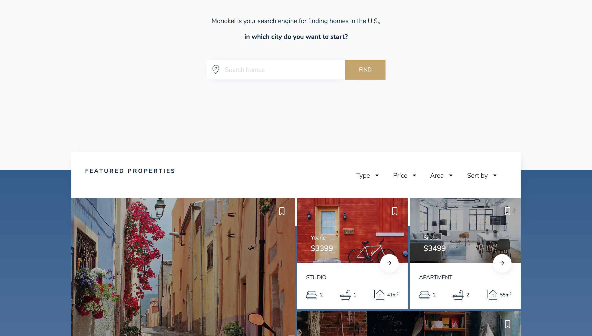

## **Design credit of the project: [Olga Radzikowna](https://dribbble.com/shots/4177962-Find-fancy-home-abroad/attachments/954897)**

## Monokel

> Monokel project is a single page real estate application. Users can be able to filter the results based on type (apartment, house, studio, villa, condo) and sorting (price, area, bedrooms, bathrooms). There is no backend API for this project, all data is located in utils folder.

This project is built using ReactJS for user interfaces and SASS for styling. I was really interested in the design since I could implement React to build many component blocks and manage states in declarative way from user input (city search & filter). Some features are not available (signup, login, bookmarks).

### Important

The search bar is limited to particular keywords of cities, which can be found in
[SEARCH_TERMS](SEARCH_TERMS.md) file.

### Demo

https://monokel-travel.herokuapp.com



### Quick Start

**Clone the project**

```shell
$ git clone https://github.com/trunglive/real-estate-project.git
```

**Run the app**

```shell
$ cd monokel
$ npm install
$ npm start
```

### Contributor

Trung Vo ([trunglive](https://github.com/trunglive))

### License

This project is licensed under the MIT License. Please check the `LICENSE` file.
